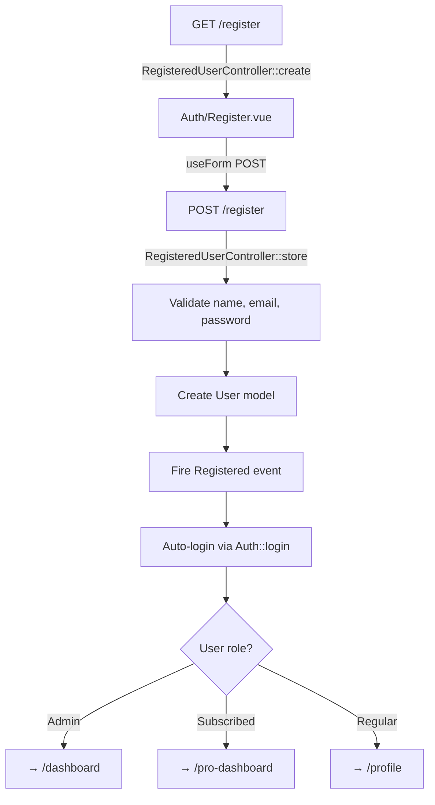
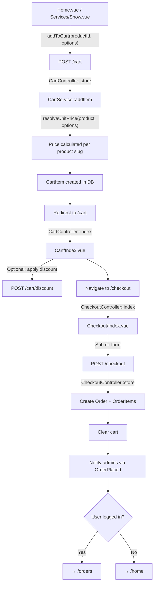

# Application Flow Overview — 8OHM Technologies

## 1. User Registration Flow

### Step-by-Step

| # | Action | Route | Controller / Method | Vue Component | Key Details |
|---|--------|-------|---------------------|---------------|-------------|
| 1 | Visit register page | `GET /register` | [RegisteredUserController::create](file:///home/tiaanf/Dev/ohmsite/app/Http/Controllers/Auth/RegisteredUserController.php#L22-L25) | [Auth/Register.vue](file:///home/tiaanf/Dev/ohmsite/resources/js/Pages/Auth/Register.vue) | Guarded by `guest` middleware. Renders a split-screen form with `name`, `email`, `password`, `password_confirmation` fields. |
| 2 | Submit registration | `POST /register` | [RegisteredUserController::store](file:///home/tiaanf/Dev/ohmsite/app/Http/Controllers/Auth/RegisteredUserController.php#L32-L51) | — | Validates input, creates `User` record, fires `Registered` event, auto-logs in. |
| 3 | Post-login redirect | — | [User::getRedirectUrl](file:///home/tiaanf/Dev/ohmsite/app/Models/User.php#L136-L147) | — | Admins → `/dashboard`, Subscribers → `/pro-dashboard`, Others → `/profile`. |
| 4 | Email verification prompt | `GET /verify-email` | [EmailVerificationPromptController](file:///home/tiaanf/Dev/ohmsite/app/Http/Controllers/Auth/EmailVerificationPromptController.php) | [Auth/VerifyEmail.vue](file:///home/tiaanf/Dev/ohmsite/resources/js/Pages/Auth/VerifyEmail.vue) | Shown if user hasn't verified email yet. Uses `GuestLayout`. |
| 5 | Resend verification | `POST /email/verification-notification` | [EmailVerificationNotificationController::store](file:///home/tiaanf/Dev/ohmsite/app/Http/Controllers/Auth/EmailVerificationNotificationController.php) | — | Throttled at 6 requests/minute. |
| 6 | Verify email via link | `GET /verify-email/{id}/{hash}` | [VerifyEmailController](file:///home/tiaanf/Dev/ohmsite/app/Http/Controllers/Auth/VerifyEmailController.php) | — | Signed URL. Marks email as verified, fires `Verified` event, redirects via `getRedirectUrl()`. |

> [!NOTE]
> The `Registered` event triggers Laravel's built-in email verification notification (via the `MustVerifyEmail` contract). Routes requiring `verified` middleware (checkout gating, dashboard access) will redirect unverified users to the verification prompt.

---

## 2. Payment Flows

All three product types share the **same cart → checkout → order pipeline**. The difference is in the **product slug** and the **options** passed when adding to cart.

### 2.1 Shared Purchase Pipeline

### Step-by-Step (shared across all product types)

| # | Action | Route | Controller / Method | Vue Component | Key Details |
|---|--------|-------|---------------------|---------------|-------------|
| 1 | Browse products | `GET /` or `GET /services` | [HomeController::index](file:///home/tiaanf/Dev/ohmsite/app/Http/Controllers/HomeController.php#L42-L108) / [ShopController::index](file:///home/tiaanf/Dev/ohmsite/app/Http/Controllers/ShopController.php#L12-L80) | [Home.vue](file:///home/tiaanf/Dev/ohmsite/resources/js/Pages/Home.vue) / [Services/Index.vue](file:///home/tiaanf/Dev/ohmsite/resources/js/Pages/Services/Index.vue) | Home page loads products by slug; Services page paginates all products with filtering. |
| 2 | View product detail | `GET /services/{product}` | [ShopController::show](file:///home/tiaanf/Dev/ohmsite/app/Http/Controllers/ShopController.php#L82-L101) | [Services/Show.vue](file:///home/tiaanf/Dev/ohmsite/resources/js/Pages/Services/Show.vue) | Increments `clicks`, loads related products, shows gallery. |
| 3 | Add to cart | `POST /cart` | [CartController::store](file:///home/tiaanf/Dev/ohmsite/app/Http/Controllers/CartController.php#L39-L54) → [CartService::addItem](file:///home/tiaanf/Dev/ohmsite/app/Services/CartService.php#L34-L55) | — | Creates/finds `Cart` (by `user_id` or `session_id`). Calls `resolveUnitPrice()` for dynamic pricing. Deduplicates by `product_id` + `options`. |
| 4 | View cart | `GET /cart` | [CartController::index](file:///home/tiaanf/Dev/ohmsite/app/Http/Controllers/CartController.php#L26-L34) | [Cart/Index.vue](file:///home/tiaanf/Dev/ohmsite/resources/js/Pages/Cart/Index.vue) | Uses [useCartStore](file:///home/tiaanf/Dev/ohmsite/resources/js/Stores/useCartStore.js) (Pinia) for optimistic UI. Shows items, quantities, summary sidebar with discount support. |
| 5 | Apply discount | `POST /cart/discount` | [DiscountController::apply](file:///home/tiaanf/Dev/ohmsite/app/Http/Controllers/DiscountController.php#L23-L36) → [CartService::applyDiscount](file:///home/tiaanf/Dev/ohmsite/app/Services/CartService.php#L92-L110) | — | Validates code, checks `min_order`, attaches `Discount` to `Cart`. Supports `percentage` and `fixed` types. |
| 6 | Checkout page | `GET /checkout` | [CheckoutController::index](file:///home/tiaanf/Dev/ohmsite/app/Http/Controllers/CheckoutController.php#L30-L45) | [Checkout/Index.vue](file:///home/tiaanf/Dev/ohmsite/resources/js/Pages/Checkout/Index.vue) | Throttled. Redirects to cart if empty. Collects: email, first/last name, country, phone. Payment method hardcoded to **Paystack**. |
| 7 | Place order | `POST /checkout` | [CheckoutController::store](file:///home/tiaanf/Dev/ohmsite/app/Http/Controllers/CheckoutController.php#L50-L113) | — | Creates `Order` (status: `pending`, payment_status: `pending`), creates `OrderItem` rows, clears cart, sends [OrderPlaced](file:///home/tiaanf/Dev/ohmsite/app/Notifications/OrderPlaced.php) notification to all admin users (database channel). |
| 8 | View orders | `GET /orders` | [UserOrderController::index](file:///home/tiaanf/Dev/ohmsite/app/Http/Controllers/UserOrderController.php) | [Profile/Orders.vue](file:///home/tiaanf/Dev/ohmsite/resources/js/Pages/Profile) | Shows user's order history with items and products. |
| 9 | Admin confirms payment | `PATCH /admin/orders/{order}/update-status` | [Admin\OrderController::updateStatus](file:///home/tiaanf/Dev/ohmsite/app/Http/Controllers/Admin/OrderController.php#L46-L56) | Admin/Orders/Index.vue | Admin manually updates `status` and `payment_status` (e.g. to `paid`). |

---

### 2.2 Product-Specific Differences

#### Once-off Datasets (`slug: once-off-dataset`)

| Aspect | Detail |
|--------|--------|
| **Entry point** | [Home.vue → handlePurchaseOnceOff](file:///home/tiaanf/Dev/ohmsite/resources/js/Pages/Home.vue#L199-L203) |
| **Options sent** | `{ dataset: 'ccma' \| 'labour-court' \| 'all' }` |
| **Pricing logic** | [CartService::resolveUnitPrice](file:///home/tiaanf/Dev/ohmsite/app/Services/CartService.php#L163-L173) — Base price per dataset; `all` = `n × base - (n-1) × R500` discount |
| **Access gate** | [User::hasOnceOffDatasetAccess](file:///home/tiaanf/Dev/ohmsite/app/Models/User.php#L102-L114) — checks for a paid order containing this product slug |
| **Middleware** | `has.dataset.access` → [DatasetAccessMiddleware](file:///home/tiaanf/Dev/ohmsite/app/Http/Middleware/DatasetAccessMiddleware.php) |
| **Protected resource** | `GET /downloads/{dataset}` → [DownloadController::download](file:///home/tiaanf/Dev/ohmsite/app/Http/Controllers/DownloadController.php) — streams CSV file |

#### Developer API Subscription (`slug: developer-api`)

| Aspect | Detail |
|--------|--------|
| **Entry point** | [Home.vue → handleSubscribeDeveloper](file:///home/tiaanf/Dev/ohmsite/resources/js/Pages/Home.vue#L205-L212) |
| **Options sent** | `{ dataset: 'ccma' \| 'all', frequency: 'monthly' \| 'annually' }` |
| **Pricing logic** | [CartService::resolveUnitPrice](file:///home/tiaanf/Dev/ohmsite/app/Services/CartService.php#L175-L190) — Monthly = base; Annual = base × 10. `all` datasets adds R100/mo or R1000/yr per extra dataset. |
| **Access gate** | [User::hasApiSubscriptionAccess](file:///home/tiaanf/Dev/ohmsite/app/Models/User.php#L119-L131) — checks for a paid order with this slug |
| **Middleware** | `has.api.access` → [ApiAccessMiddleware](file:///home/tiaanf/Dev/ohmsite/app/Http/Middleware/ApiAccessMiddleware.php) |
| **Protected resource** | `GET /developer/docs` → [ApiDocsController::index](file:///home/tiaanf/Dev/ohmsite/app/Http/Controllers/ApiDocsController.php) → [Developer/Docs.vue](file:///home/tiaanf/Dev/ohmsite/resources/js/Pages/Developer/Docs.vue) |

#### Pro Analytics Subscription (`slug: pro-analytics`)

| Aspect | Detail |
|--------|--------|
| **Entry point** | [Home.vue → handleSubscribeAnalytics](file:///home/tiaanf/Dev/ohmsite/resources/js/Pages/Home.vue#L214-L220) |
| **Options sent** | `{ frequency: 'monthly' \| 'annually' }` |
| **Pricing logic** | [CartService::resolveUnitPrice](file:///home/tiaanf/Dev/ohmsite/app/Services/CartService.php#L192-L197) — Monthly = base; Annual = base × 10 |
| **Access gate** | [User::isSubscribed](file:///home/tiaanf/Dev/ohmsite/app/Models/User.php#L85-L97) — checks for a paid order with this slug |
| **Middleware** | `subscribed` → [SubscribedMiddleware](file:///home/tiaanf/Dev/ohmsite/app/Http/Middleware/SubscribedMiddleware.php) |
| **Protected resource** | `GET /pro-dashboard` → [SubscriberController::index](file:///home/tiaanf/Dev/ohmsite/app/Http/Controllers/SubscriberController.php) → [Subscriber/Analytics/Index.vue](file:///home/tiaanf/Dev/ohmsite/resources/js/Pages/Subscriber/Analytics) |

---

## 3. Key Architecture Notes

### Cart System
- **Dual-identity carts**: Cart is resolved by `user_id` (authenticated) or `session_id` (guest) via [CartService::getCart](file:///home/tiaanf/Dev/ohmsite/app/Services/CartService.php#L20-L29).
- **Dynamic pricing**: [resolveUnitPrice](file:///home/tiaanf/Dev/ohmsite/app/Services/CartService.php#L161-L207) calculates the unit price at add-to-cart time based on `product.slug` + `options`. There's no Stripe/Paystack checkout session — orders are created with `payment_status: pending`.
- **State management**: Frontend uses [useCartStore](file:///home/tiaanf/Dev/ohmsite/resources/js/Stores/useCartStore.js) (Pinia) with optimistic UI updates, synced with Inertia props.

### Payment Processing

> [!IMPORTANT]
> The checkout currently creates orders with `payment_status: 'pending'` and `payment_method: 'paystack'`, but **there is no Paystack integration yet**. The UI shows "Paystack" as the payment method, but the `POST /checkout` endpoint creates the order directly without initiating a payment gateway redirect or webhook.
>
> Orders are manually marked as `paid` by an admin via `PATCH /admin/orders/{order}/update-status`.

### Access Control
- Product access is **order-based**, not subscription-based: each middleware/gate checks if the user has a `paid` order containing the specific `product.slug`.
- Admins bypass all access checks via `isAdmin()`.
- The `verified` middleware is applied to the pro-dashboard and download routes, requiring email verification.

### Middleware Registration ([bootstrap/app.php](file:///home/tiaanf/Dev/ohmsite/bootstrap/app.php))

| Alias | Middleware | Purpose |
|-------|-----------|---------|
| `admin` | [AdminMiddleware](file:///home/tiaanf/Dev/ohmsite/app/Http/Middleware/AdminMiddleware.php) | Admin panel access |
| `subscribed` | [SubscribedMiddleware](file:///home/tiaanf/Dev/ohmsite/app/Http/Middleware/SubscribedMiddleware.php) | Pro Analytics dashboard |
| `has.dataset.access` | [DatasetAccessMiddleware](file:///home/tiaanf/Dev/ohmsite/app/Http/Middleware/DatasetAccessMiddleware.php) | Dataset downloads |
| `has.api.access` | [ApiAccessMiddleware](file:///home/tiaanf/Dev/ohmsite/app/Http/Middleware/ApiAccessMiddleware.php) | Developer API docs |
